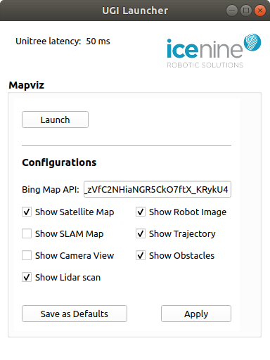
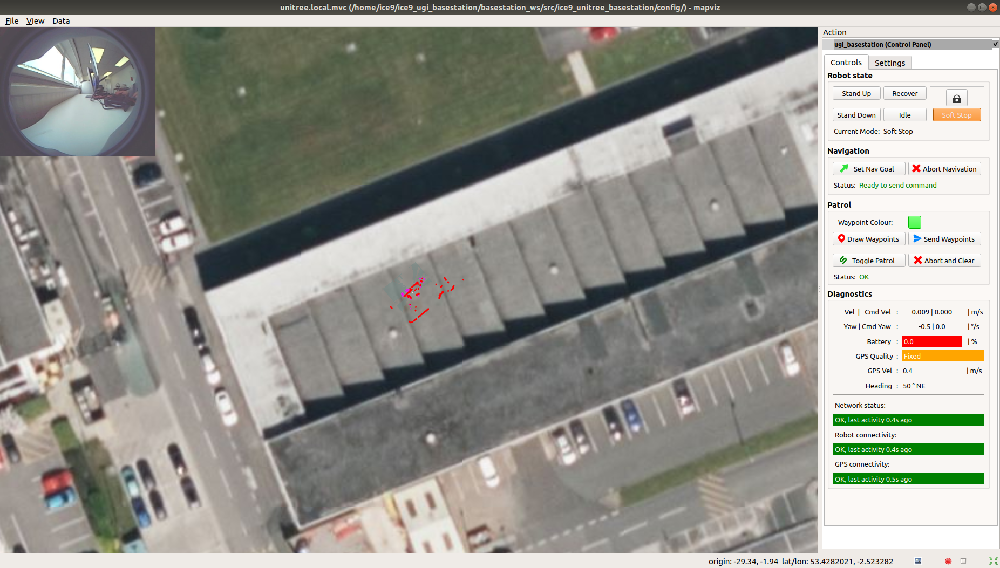

[](ice9_logo_full.png)

### Contents
- [Overview](#overview)
    - [Software package](#software-package)
- [Installation](#installation)
- [Launcher User Interface](#launcher)
- [Mapviz User Interface](#mapviz)
- [Troubleshooting](#troubleshooting)

# Overview
The basestation software package is developed to work specifically with the [Unitree GPS Integration (UGI)](https://github.com/ICE9-Robotics/ice9_ugi) software for a Unitree GO 1 robot.

## Software package
The basestation package contains two pieces of software user interface: **Launcher** and **Mapviz**.

**Launcher** is designed to help user launch and config Mapviz more conveniently.

[**Mapviz**](https://swri-robotics.github.io/mapviz/) is a ROS visualisation tool developed by [South West Research Institute](https://www.swri.org/industries/industrial-robotics-automation) mainly for autonomous car research. It is specialist software that is not very approachable to users with limited programming knowledge or ROS experience. We have tweaked the UI and developed a prepritory plugin for this Unitree project, to make it more friendly to non developers.

# Installation
Starting from a fresh Ubuntu installation, open up a terminal, then copy and paste the following code:
```
cd ~
git clone https://github.com/ICE9-Robotics/ice9_ugi_basestation.git
cd ice9_ugi_basestation/install
./setup_ubuntu.sh
./install_basestation.sh
```

# Launcher

[](Launcher GUI)

#### Unitree latency
Latency between the basestation PC and the robot, measured up to 1000 ms.

#### Mapviz panel
- Launch: launch the Mapviz interface.
- Congiurations:
    - Bing Map API: follow [create-a-bing-maps-key](https://www.microsoft.com/en-us/maps/bing-maps/create-a-bing-maps-key) to create a key and paste it here.
    - Show Satellite Map: show/hide the satellite map from Bing map, requires a valide Bing Map API.
    - Show SLAM Map: show/hide a 2D map overlay generated by the robot. This consumes significant network bandwidth. If Mapviz lags due to high latency or slow network speed, toggle this off.
    - Show Camera View: show/hide the robot's front camera view. This consumes significant network bandwidth. If Mapviz lags due to high latency or slow network speed, toggle this off.
    - Show Lidar Scan: show/hide lidar scan points in red.
    - Show Robot Image: show/hide an image representing the robot.
    - Show Trajectory: show/hide the trajectory of the robot.
    - Show Obstacles: show/hide local obstacles in purple blocks.
    - Save as Defaults: save the configurations as default.
    - Apply: apply the configurations to the current Mapviz window. In poor network condition, this can be very slow or freeze the application completely.

# Mapviz

[](Mapviz GUI)

The interface is split into two parts.

The centre area is for data visualisation, where you can visualise the location of the robot on a satellite map with slam map overlay, lidar scan points, etc. depanding on the configurations.

The Action panel on the right is the interface for interacting with the robot.

Controls tab:
- Robot state
    - Stand Up: set the robot into the "stand up" position
    - Stand Down: set the robot into the "stand down" position similar to a crawl pose
    - Recover: *use with caution!* recover the robot from failed state (e.g. fallen over)
    - Idle: set the robot into the "idle" state. Use this button only as the last resort to stop the robot from doing unexpected motion.
    - Soft Stop: set the robot into the "damping" state. The motors will be relaxed and try to resist against motion. The robot will **collapse** down if its belly is not already touching the ground. This option is normally available only when the robot is in "stand down" position.
    - Lock button: unlcok Soft Stop button in all situations.
- Navigation:
    - Set Nav Goal: draw on the map to set an one-off goal position and pose for the robot to navigate towards.
    - Abort Navigation: abort the "Set Nav Goal" command. Does not stop patrol mode!
- Patrol:
    - Waypoint Colour: change the colour of waypoints.
    - Draw Waypoints: draw or modify waypoints on the map for the robot to navigate through in sequence. Left click to add, hold and drag to move and right click to delete. The first and the last waypoints will automatically connect to form a closed loop.
    - Send Waypoints: send the waypoints to robot.
    - Toggle Patrol: toggle patrol on and off. You must Send Waypoints first!
    - Abort and Clear: abort patrol and clear all waypoints.
- Diagnostics: (color coding: green = great, yellow = acceptable, red = bad)
    - Vel | Cmd Vel: velocity reported by the robot (quite noisy) | command velocity received by the robot
    - Yaw | Cmd Yaw: yaw speed reported by the robot (quite noisy) | command yaw speed received by the robot
    - Battery: percentage of battery capacity
    - GPS Quality: No fix 
    - GPS Vel: velocity reported by GPS (can be used to estimate the quality of the GPS while the robot is stationary)
    - Heading: heading reported by the integrated magnetometer.
    - Network status: shows the quality of the ROS network.
    - Robot connectivity: indicates the responsiveness of the robot base constroller, largely affected by network status.
    - GPS connectivity: shows the GPS delay.

Settings tab:
- Map offset: correct offset between SLAM map/Lidar scan and satellite map.
- Motion: adjust velocity and acceleration of the robot. This affects navigation and patrol motions only and does not work for joystick controls.
- Camera: adjust camera parameters. Brightness and manual exposure adjustments are not available when auto exposure is checked.

# Troubleshooting
### Mapviz is unresponsive for a few seconds or longer
This is normally caused by slow network speed on either the robot or the basestation. ROS communication requires at least 24 Mbps or 3 MB/s upload and download speed to run smoothly. 

Solutions:
1. Improve the network speed by moving the robot and/or the basestation to a location with better network signal.
2. If network speed does not improve, from the launcher UI, uncheck `Show Camera View`, click `Save as Defaults`, restart Mapviz. 
3. If the aboves do not solve the problem, uncheck `Show SLAM Map` as well and save as defaults, then restart Mapviz.